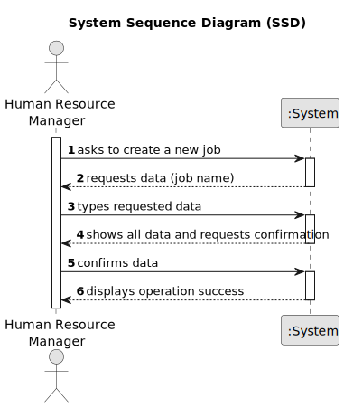

# US006 - Create a Task 

## 1. Requirements Engineering

### 1.1. User Story Description

As an Human Resource Manager (HRM), I want to register a job that a collaborator need to have.

### 1.2. Customer Specifications and Clarifications 

**From the specifications document:**

>	There are no specifications.

**From the client clarifications:**

> **Question:** What are the input data for creating job?
>
> **Answer:** Input data is name of the job.

### 1.3. Acceptance Criteria

* **AC1:** All required fields must be filled in.
* **AC2:** When creating a job that already exist, the system must reject such operation and the user must be able to modify the typed reference.

### 1.4. Found out Dependencies

* There is no dependency.

### 1.5 Input and Output Data

**Input Data:**

* Typed data:
    * a job name
	
* Selected data:
    * There is no selected data 

**Output Data:**

* List of existing jobs
* (In)Success of the operation

### 1.6. System Sequence Diagram (SSD)

### 1.7 Other Relevant Remarks

* There are no relevant remarks.