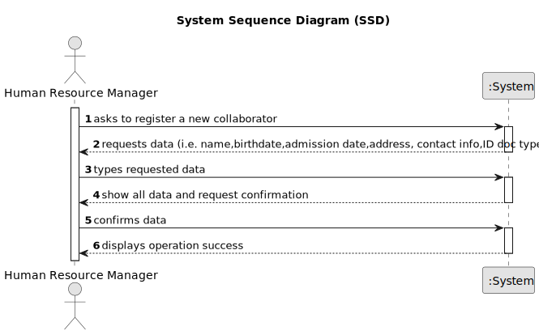

# US003 -  Register a collaborator with a job and fundamental characteristics. 

## 1. Requirements Engineering

### 1.1. User Story Description

As an HRM, I want to register a collaborator with a job and fundamental
characteristics.

### 1.2. Customer Specifications and Clarifications 

**From the specifications document:**

>The following data is requierd: name, birthdate, admission date, address, contact info (mobile and
email), ID doc type and respective number should be provided by HRM
**From the client clarifications:**

### 1.3. Acceptance Criteria

* **AC1:** All required fields must be filled in.
* **AC2:** The task reference must have at least 5 alphanumeric characters.
* **AC3:** When registering a collaborator with an existing reference, the system must reject such operation and the user must be able to modify the typed reference.

### 1.4. Found out Dependencies

* There are no dependencies found.

### 1.5 Input and Output Data

**Input Data:**

* Typed data:
  * Collaborator's name
  * Collaborator's birthdate
  * Collaborator's admission date
  * Collaborator's address
  * Collaborator's contact information (mobile and email)
  * Collaborator's ID document type
  * Collaborator's ID document number
  * Job details (designation, job category, etc.)
	

**Output Data:**

* Success/Failure message indicating the registration of the collaborator
* List of existing job categories for reference

### 1.6. System Sequence Diagram (SSD)

**_Other alternatives might exist._**

#### Alternative One

### 1.7 Other Relevant Remarks

* There are no Relevant Remarks