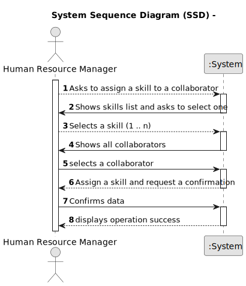

# US04 -  Assign skills

## 1. Requirements Engineering

### 1.1. User Story Description

As an HRM, I want to assign one or more skills to a collaborator.

### 1.2. Customer Specifications and Clarifications

**From the specifications document:**

>	The system must allow HRMs to associate skills with individual collaborators.

**From the client clarifications:**

> **Question:** Is there any certification/proof needed to register a skill to a colaborator?
>
> **Answer:** No certification is required

 > **Question:** Can the collaborator have no skills assigned?
>
> **Answer:** Yes.

> **Question:** Is there a maximum or minimum amount of skills that may be assigned at once?
>
> **Answer:** No.

> **Question:** Is there a special requirement necessary for the collaborator to be assigned a skill?
>
> **Answer:** No.

### 1.3. Acceptance Criteria

* **AC1:** All required fields must be filled in.
* **AC2:** HRM must be able to assign multiple skills to a single collaborator.
* **AC3:** When assigning  with an existing reference, the system must reject such operation and the user must be able to modify the typed reference.

### 1.4. Found out Dependencies

* There is a dependency on "US001 - Register skills" as skills need to be predefined and available for assignment.

### 1.5 Input and Output Data

**Input Data:**

* Typed data:
    * Collaborator's name or identifier
     * Skills to be assigned

**Output Data:**

* Success/Failure message indicating the assignment of skills to the collaborator
* List of available skills for reference

### 1.6. System Sequence Diagram (SSD)

**_Other alternatives might exist._**

#### Alternative One

### 1.7 Other Relevant Remarks

* There are no Relevant Remarks
