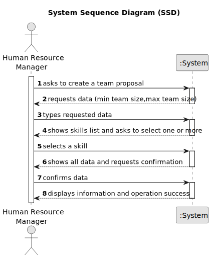

# US005 - Generate Team Proposal

## 1. Requirements Engineering

### 1.1. User Story Description

As a Human Resource Manager (HRM), I want to generate a team proposal automatically.

### 1.2. Customer Specifications and Clarifications 

**From the specifications document:**

>	 The maximum team size and the set of skills need to be supplied by the HRM.

**From the client clarifications:**

> **Question:** Which business rules apply for the input data to generate a team proposal?
>
> **Answer:** max and min team size, and list of skills needed.For instance: minimum 2 and maximum 4.

>  **Question:** How does it generate the team if there are not enough employees?
>
> **Answer:** The system should not generate team and provide information why it can't generate a team.

### ???? 1.3. Acceptance Criteria

* **AC1:** All required fields must be filled in.
* **AC2:** Collaborator can not  be in 2 different team at the same time.

### ????? 1.4. Found out Dependencies

* There is a dependency on "US001 - Register Skills"  as there must be at least one skill to adding to team being created.
* There is a dependency on "US003 - Register Collaborator"  as there must be at least one collaborator to adding to team being created.
* ??? There is a dependency on "US004 - Assign Skills"  as there must be at least one collaborator to adding to team being created.

### 1.5 Input and Output Data

**Input Data:**

* Typed data:
    * minimum team size
    * maximum team size
	
* Selected data:
    * list of skills 

**Output Data:**

* Information that contain each of team members and its skills.
* (In)Success of the operation

### 1.6. System Sequence Diagram (SSD)

### 1.7 Other Relevant Remarks

* There are no relevant remarks.