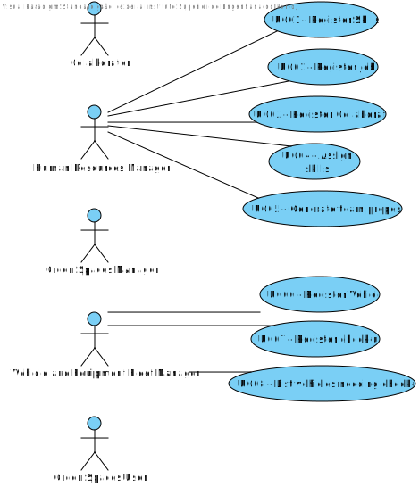

# Use Case Diagram (UCD)

**In the scope of this project, there is a direct relationship of _1 to 1_ between Use Cases (UC) and User Stories (US).**

However, be aware, this is a pedagogical simplification. On further projects and course units there may also exist _1 to N **and/or** N to 1_ relationships between UC and US.

# Use Cases / User Stories

| UC/US | Description                                                  |                   
|:------|:-------------------------------------------------------------|
| UC01  | [Register Skills](../../us01/Readme.md)                      |
| UC02  | [Register Job](../../us02/Readme.md)                         |
| UC03  | [Register Collaborator](../../us03/Readme.md)                |
| UC04  | [Assign Skills](../../us04/Readme.md)                        |
| UC05  | [Generate team proposal](../../us05/Readme.md)               |
| UC06  | [Register Vehicle](../../us06/Readme.md)                     |
| UC07  | [Register check-up](../../us07/Readme.md)                    |
| UC08  | [List vehicles needing check-up](../../us08/Readme.md)       |
| UC09  | [Calculate costs of water consumption](../../us09/Readme.md) |
| UC10  | [Check equipment used](../../us10/Readme.md)                 |
| UC11  | [Collect data from user portal](../../us11/Readme.md)        |
| UC12  | [Import file of water point routes](../../us12/Readme.md)    |
| UC13  | [Apply algorithm](../../us013/Readme.md)                     |
| UC14  | [Run tests for UC13](../../us14/Readme.md)                   |
