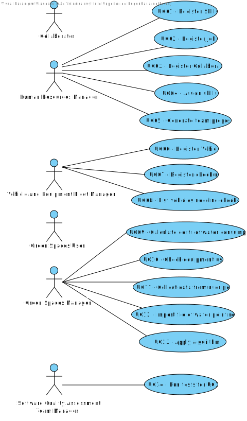

# Use Case Diagram (UCD)

**In the scope of this project, there is a direct relationship of _1 to 1_ between Use Cases (UC) and User Stories (US).**

However, be aware, this is a pedagogical simplification. On further projects and course units there may also exist _1 to N **and/or** N to 1_ relationships between UC and US.

# Use Cases / User Stories

| UC/US | Description                                             |                   
|:------|:--------------------------------------------------------|
| UC01  | [Register Skills](../../us001/Readme.md)                |
| UC02  | [Register Job](../../us002/Readme.md)                   |
| UC03  | [Register Collaborator](../../us003/Readme.md)          |
| UC04  | [Assign Skills](../../us004/Readme.md)                  |
| UC05  | [Generate team proposal](../../us005/Readme.md)         |
| UC06  | [Register Vehicle](../../us006/Readme.md)               |
| UC07  | [Register check-up](../../us007/Readme.md)              |
| UC08  | [List vehicles needing check-up](../../us008/Readme.md) |
