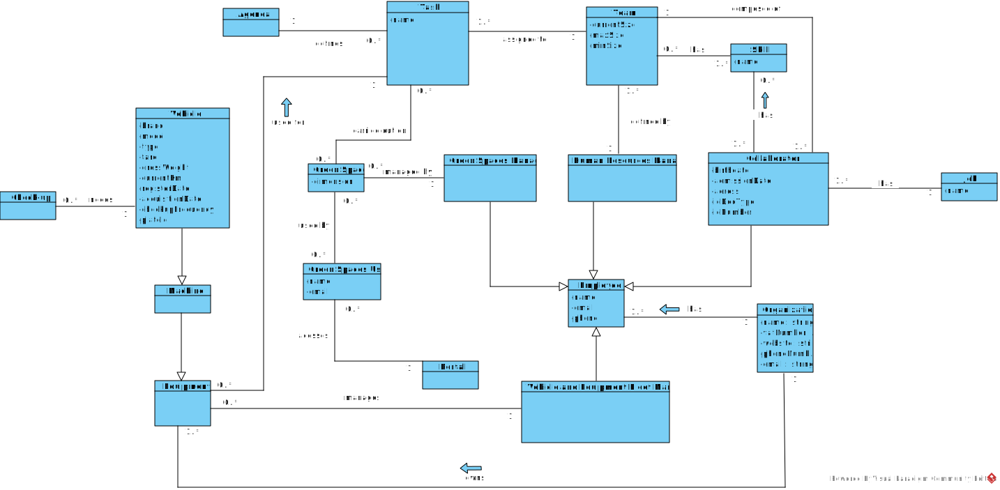

# OO Analysis

## Rationale to identify domain conceptual classes

### _Conceptual Class Category List_

**Business Transactions**

* Task

---

**Transaction Line Items**

*

---

**Product/Service related to a Transaction or Transaction Line Item**

* Vehicle
* Machine
* Equipment

---

**Transaction Records**

* Agenda

---  

**Roles of People or Organizations**

* Collaborator
* Human Resources Manager
* Vehicle and Equipment Fleet Manager
* Green Spaces Manager
* Green Spaces User

---

**Places**

* Green Space

---

**Noteworthy Events**

* Vehicle Check-up

---

**Physical Objects**

*

---

**Descriptions of Things**

* Skill
* Job

---

**Catalogs**

* Green Spaces User Portal

---

**Containers**

* Team

---

**Elements of Containers**

*

---

**Organizations**

* Organization

---

**Other External/Collaborating Systems**

*

---

**Records of finance, work, contracts, legal matters**

*

---

**Financial Instruments**

*

---

**Documents mentioned/used to perform some work/**

*

---

## Rationale to identify associations between conceptual classes

| Concept (A)       		|  Association   	|  Concept (B)                        |
| --------------------	| -------------  	| ------:---------------------------- |
| Organization        	| manages    		 	| Green Space                         |
|                       | has             | Collaborator                        |
|                       | has             | Human Resources Manager             |
|                       | has             | Vehicle and Equipment Fleet Manager |
| Collaborator          | has             | Skill                               |
|                       | has             | Job                                 |
| Task                  | assigned to     | Team                                |
|                       | carried out on  | Green Space                         |
|                       | uses            | Vehicle                             |
|                       | uses            | Machine                             |
|                       | uses            | Equipment                           |
| Team                  | composed of     | Collaborator                        |
|                       | defined by      | Human Resources Manager             |
| Agenda                | defines         | Task                                |
| Vehicle Fleet Manager | manages         | Vehicle                             |
|                       | manages         | Equipment                           |
|                       | manages         | Machine                             |
| Green Spaces User     | accesses        | Portal                              |
|                       | uses            | Green Space                         |
| Green Spaces Manager  | is in charge of | Organization                        |

## Domain Model

