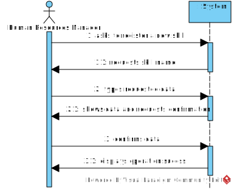

# US01 - Register Skills

## 1. Requirements Engineering

### 1.1. User Story Description

As a Human Resources Manager (HRM), I want to register skills that a collaborator may have.

### 1.2. Customer Specifications and Clarifications

**From the specifications document:**

>	special characters or numerals should not be allowed in the skill name.

**From the client clarifications:**

> **Question:** Which information is mandatory for creating a new skill?
>
> **Answer:** The skill name.

> **Question:** Which are the skills accepted? Or should we enable the HRM to introduce anything as a skill?
>
> **Answer:** >	All, it's up to HRM to decide. (special characters or numerals should not be allowed in the skill name).

### 1.3. Acceptance Criteria

* **AC1:** The skill name field must be filled in.

### 1.4. Found out Dependencies

### 1.5 Input and Output Data

**Input Data:**

* Typed data:
    * a name

**Output Data:**

* List of existing skills
* (In)Success of the operation

### 1.6. System Sequence Diagram (SSD)

### 1.7 Other Relevant Remarks
