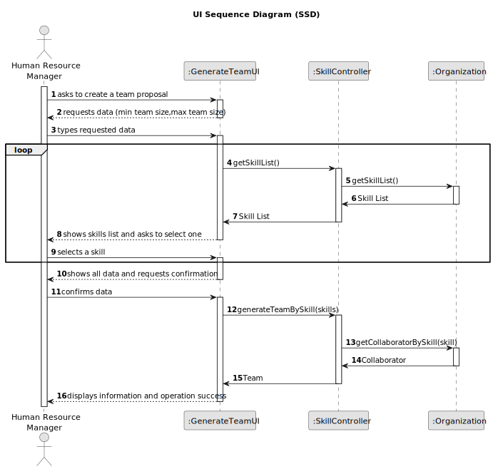

# US05 - Generate Team Proposal

# 3. Design - User Story Realization 

## 3.1. Rationale

### Systematization ##

## 3.2. Sequence Diagram (SD)

### Full Diagram

### Split Diagrams

## 3.3. Class Diagram (CD)
