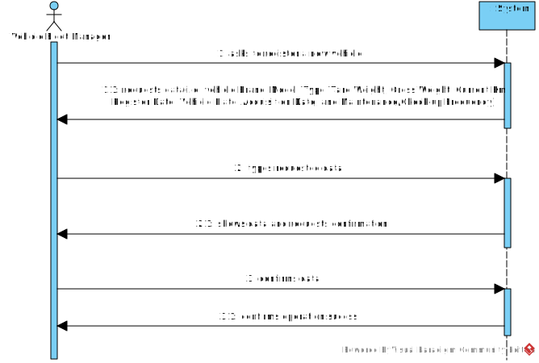

# US06 - Register Vehicle

## 1. Requirements Engineering

### 1.1. User Story Description

As a VFM, I wish to register a vehicle including Brand, Model, Type, Tare Weight, Gross Weight, Current Km, Register Date, Vehicle Plate, Acquisition Date, and Maintenance/Check-up Frequency (in km).

### 1.2. Customer Specifications and Clarifications

**From the specifications document:**

>	 Vehicles are needed to carry out the tasks assigned to the teams and to
   transport machines and equipment. This type of vehicle may be only for
   passengers or mixed, light or heavy, open box or closed vans or trucks.

**From the client clarifications:**

> **Question:** For the application to work does the FM need to fill all the attributes of the vehicle?
>
> **Answer:** yes, besides the vehicle plate that by mistake doesn't appear on the text.

### 1.3. Acceptance Criteria

* **AC1:** All required fields must be filled in.

### 1.4. Found out Dependencies

* There is a dependency on "US07 - Register Check-up"  as there must be at least one vehicle to register a check-up for.

### 1.5 Input and Output Data

**Input Data:**

* Typed data:
    * Brand
    * Model
    * Type
    * Tare Weight
    * Gross Weight
    * Current Km
    * Register Date
    * Vehicle plate
    * Acquisition Date
    * Check-up Frequency

**Output Data:**

* Vehicle Registered
* (In)Success of the operation

### 1.6. System Sequence Diagram (SSD)

### 1.7 Other Relevant Remarks

* There are no relevant remarks.
