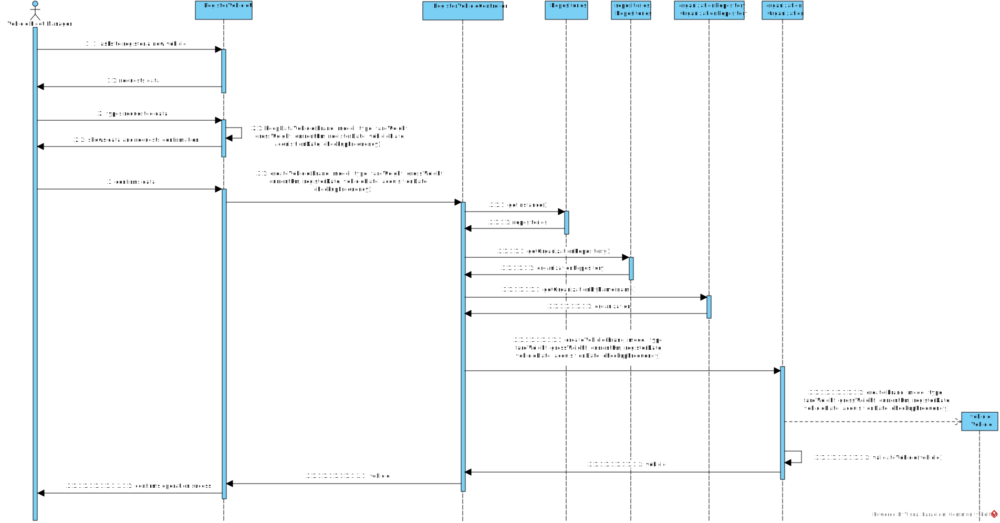
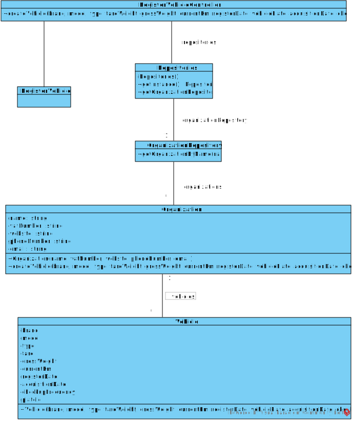

# US06 - Register Vehicle

## 3. Design - User Story Realization

### 3.1. Rationale

| Interaction ID | Question: Which class is responsible for...         | Answer                    | Justification (with patterns)                                                                                 |
|:-------------  |:--------------------------------------------------- |:--------------------------|:--------------------------------------------------------------------------------------------------------------|
| Step 1  		 |	... interacting with the actor?                      | RegisterVehicleUI         | Pure Fabrication: there is no reason to assign this responsibility to any existing class in the Domain Model. |
| 			  		 |	... coordinating the US?                             | RegisterVehicleController | Controller                                                                                                    |
| Step 2  		 |	... displaying the form for user to input data       | RegisterVehicleUI         | Pure Fabrication/IE                                                                                           |
| Step 3			 |	...saving the inputted data?                         | RegisterVehicleUI         | Pure Fabrication                                                                                              |
|        			 |	...validating inputted data?                         | RegisterVehicleUI         | Pure Fabrication                                                                                              |
|         		 |	...temporarily keeping input data?                   | RegisterVehicleUI         | Pure Fabrication                                                                                              |
| Step 4       |  ...displaying all the information before submitting? | RegisterVehicleUI         | Pure Fabrication                                                                                              |
| Step 5       |  ...accepting confirmation?                           | RegisterVehicleUI         | Pure Fabrication                                                                                              |
|              |  ...validating the data locally (mandatory data)      | Vehicle                   | information Expert                                                                                            |
|              |  ...validating all data (global validation)?          | Organization              | Information Expert (knows all its Vehicles)                                                                   |
|              |  ... saving the created Vehicle?                      | Organization	             | IE: owns all its Vehicles.                                                                                    |
| Step 6       | ... informing operation success?                      | RegisterVehicleUI         | Pure Fabrication/IE                                                                                           |

### Systematization ##

According to the taken rationale, the conceptual classes promoted to software classes are:

* Organization
* Vehicle

Other software classes (i.e. Pure Fabrication) identified:

* RegisterVehicleUI  
* RegisterVehicleController

## 3.2. Sequence Diagram (SD)

### Full Diagram

This diagram shows the full sequence of interactions between the classes involved in the realization of this user story.

## 3.3. Class Diagram (CD)

